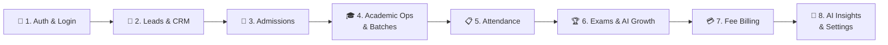
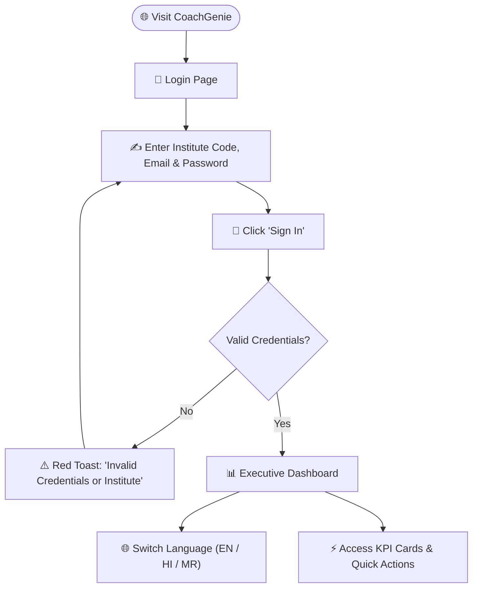
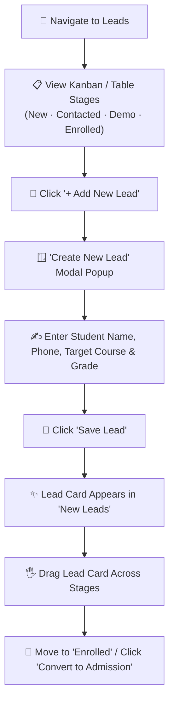
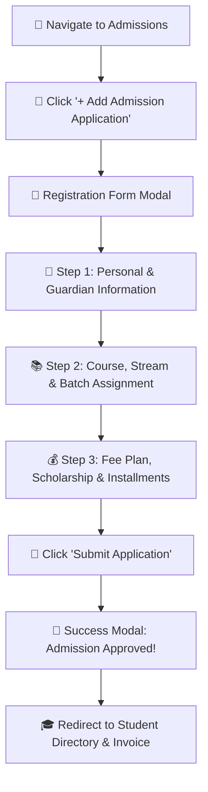
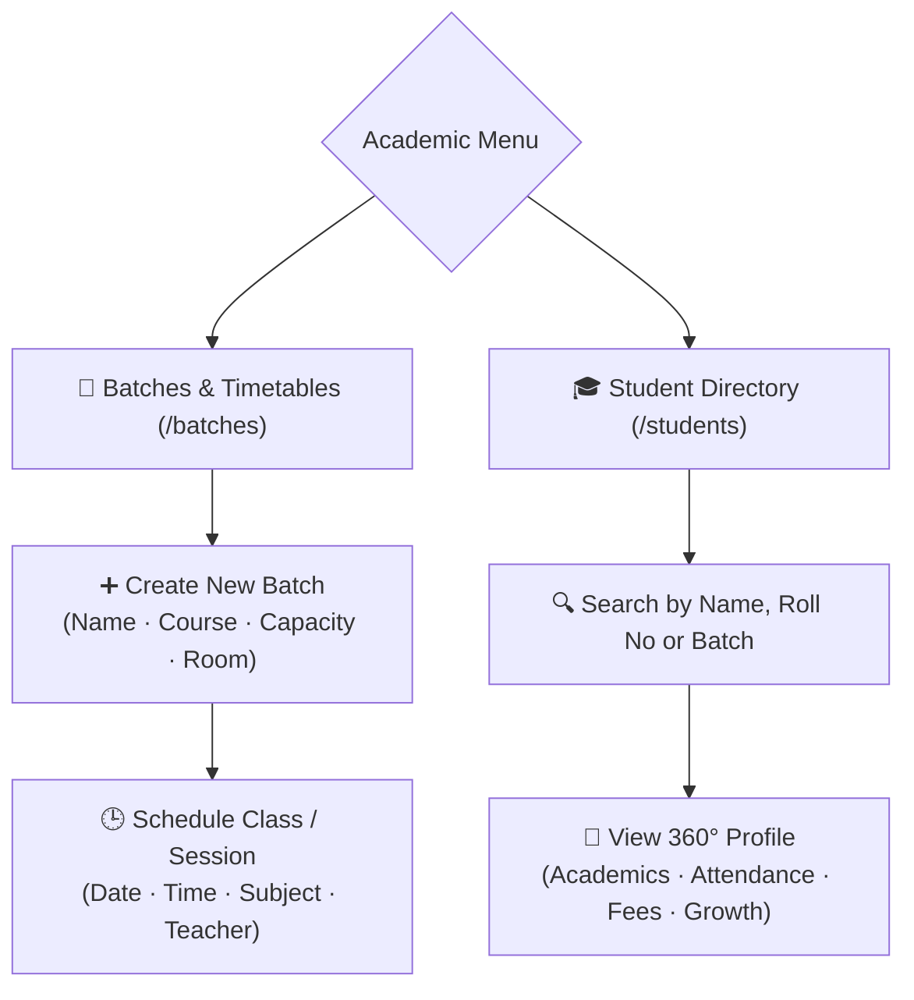
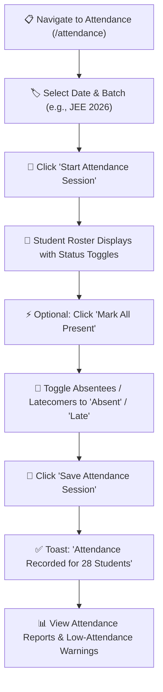
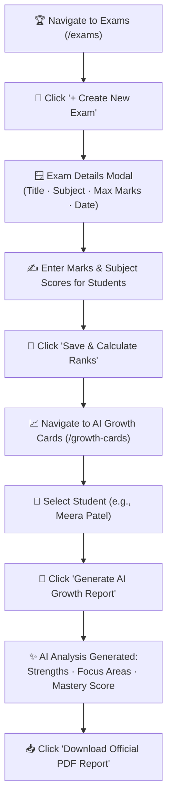
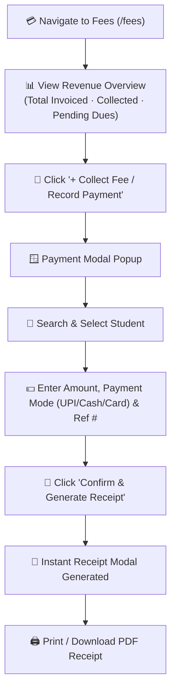
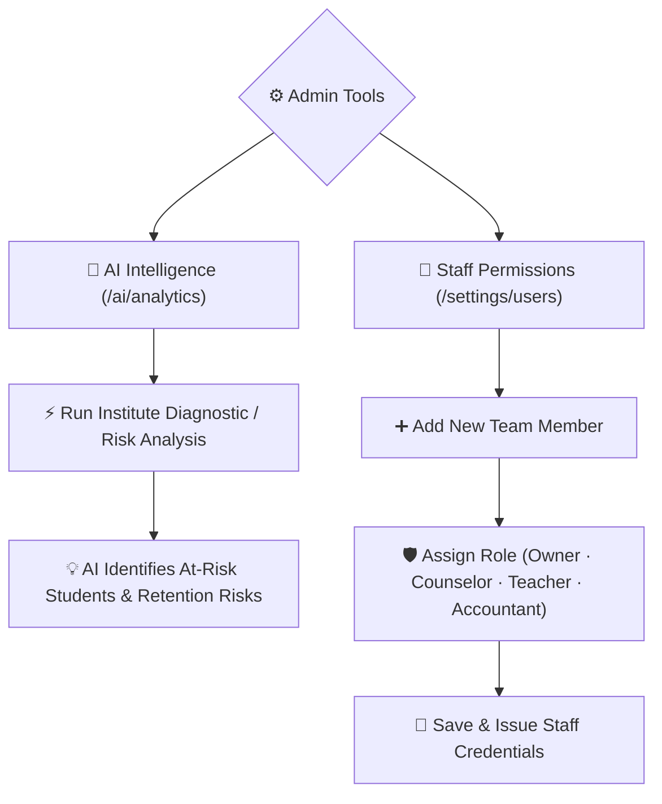

# 📘 CoachGenie End-to-End User Flow Guide

> **Author:** UX Research & Technical Writing Team  
> **Target Audience:** Institute Owners, Administrators, Academic Counselors, Faculty & Staff  
> **Application:** CoachGenie Coaching Management & Student Intelligence ERP  

---

## 🌟 Executive Summary

This guide maps out the end-to-end user experience across **CoachGenie**. It outlines every step an administrator, counselor, or teacher takes from the moment they open the login screen to enrolling students, scheduling classes, tracking attendance, generating AI-powered progress reports, and collecting fee payments.

Each journey is written entirely from the **user's perspective**—highlighting what you see, what you click, the visual feedback provided, and the automated confirmations triggered along the way.

---

## 🧭 Table of Contents

1. [Journey 1: Authentication, Language Selection & Executive Dashboard](#journey-1-authentication-language-selection--executive-dashboard)
2. [Journey 2: Lead Acquisition & Inquiry CRM Pipeline](#journey-2-lead-acquisition--inquiry-crm-pipeline)
3. [Journey 3: Student Admission & Enrollment Onboarding](#journey-3-student-admission--enrollment-onboarding)
4. [Journey 4: Academic Management — Batches, Timetables & Student Directory](#journey-4-academic-management--batches-timetables--student-directory)
5. [Journey 5: Daily Attendance Tracking & Absence Management](#journey-5-daily-attendance-tracking--absence-management)
6. [Journey 6: Examinations, Marks Entry & AI Growth Cards](#journey-6-examinations-marks-entry--ai-growth-cards)
7. [Journey 7: Fee Collection, Invoicing & Payment Receipts](#journey-7-fee-collection-invoicing--payment-receipts)
8. [Journey 8: AI Copilot Intelligence, Analytics & Staff Permissions](#journey-8-ai-copilot-intelligence-analytics--staff-permissions)

---

## Journey 1: Authentication, Language Selection & Executive Dashboard

### 🎯 What You Achieve
Sign securely into your coaching institute's dedicated workspace, set your preferred language (English, Hindi, or Marathi), and review real-time institute metrics (student count, active batches, revenue, and attendance health) on your executive dashboard.

### 📋 Scannable Step-by-Step Checklist

- [ ] **Step 1: Open the Application**  
  Navigate to the login page (`/login`). You are greeted with the clean CoachGenie branded sign-in portal.
- [ ] **Step 2: Enter Institute Code**  
  Click into the **Institute Code** field and type your organization code (e.g., `demo`).
- [ ] **Step 3: Enter User Credentials**  
  Type your registered **Email Address** (e.g., `owner@demo.com`) and **Password**.
- [ ] **Step 4: Click 'Sign In'**  
  Click the primary **Sign In** button. A smooth spinner confirms that authentication is in progress.
- [ ] **Step 5: Welcome to the Dashboard**  
  Upon successful login, you land on the **Executive Dashboard** (`/dashboard`).
- [ ] **Step 6: (Optional) Choose Language**  
  Click the **Globe / Language** icon in the top navigation bar to toggle between **English**, **हिंदी (Hindi)**, or **मराठी (Marathi)**. The interface labels immediately translate.
- [ ] **Step 7: Review Daily Analytics**  
  Inspect the live KPI cards showing **Total Students**, **Active Batches**, **Monthly Revenue**, and **Average Attendance Rate**, alongside interactive charts and student health heatmaps.

### 🔔 System-Generated Triggers & Feedback
* **Visual Transitions:** Instant button loading state and redirection to `/dashboard`.
* **Error Prevention:** Live form validation warning if required fields are blank.
* **Notification Toast:** Green success confirmation banner upon session initiation.
* **Navigation Bar:** User profile badge, notification bell, and institute workspace name updated in the top header.

---

## Journey 2: Lead Acquisition & Inquiry CRM Pipeline

### 🎯 What You Achieve
Capture prospective student inquiries, track follow-up conversations across visual pipeline stages (Kanban board), schedule demo classes, and seamlessly convert interested leads into registered admissions.

### 📋 Scannable Step-by-Step Checklist

- [ ] **Step 1: Navigate to Leads**  
  Click **Leads** in the left sidebar menu (`/leads`).
- [ ] **Step 2: Explore the Inquiry Pipeline**  
  View the visual Kanban board with stage columns: **New Inquiries**, **Contacted**, **Demo Scheduled**, **Demo Attended**, and **Enrolled**.
- [ ] **Step 3: Click '+ Add New Lead'**  
  Click the blue **+ Add New Lead** button located in the top-right corner.
- [ ] **Step 4: Fill Out Student Inquiry Details**  
  In the modal dialog that appears:
  - Enter **Student Full Name** (e.g., *Rohan Gupta*).
  - Enter **Contact Phone Number** and **Parent/Guardian Phone**.
  - Select **Current Grade/Class** (e.g., *11th Grade*) and **Target Exam** (*JEE / NEET / Foundation*).
  - Select **Lead Priority** (*Hot / Warm / Cold*) and **Source** (*Walk-in, Website, Referral*).
  - Set a **Follow-up Date**.
- [ ] **Step 5: Save the Lead**  
  Click **Save Lead**. 
- [ ] **Step 6: Track & Move Stages**  
  As counselors speak to the family, drag and drop the student's card across the pipeline columns or click on the card to log communication notes.
- [ ] **Step 7: Convert to Admission**  
  When the student decides to join, move them to the **Enrolled** column or click the **Convert to Admission** shortcut on their profile.

### 🔔 System-Generated Triggers & Feedback
* **Modal Dialog:** Interactive pop-up with clean field groups and focus highlights.
* **Success Toast:** Alert reading *"Lead added successfully"* or *"Lead status updated to Demo Scheduled"*.
* **Real-time Pipeline Counters:** Dynamic badge counters above each stage column update instantly without page reloads.

---

## Journey 3: Student Admission & Enrollment Onboarding

### 🎯 What You Achieve
Complete the formal student registration process by recording academic targets, emergency parent contacts, assigning classroom batches, setting custom tuition fees/scholarships, and generating the official student ID.

### 📋 Scannable Step-by-Step Checklist

- [ ] **Step 1: Open Admissions**  
  Click **Admissions** in the main sidebar (`/admissions`).
- [ ] **Step 2: Start a New Admission**  
  Click the primary **+ Add Admission Application** button.
- [ ] **Step 3: Enter Student & Parent Information**  
  - Provide Student Full Name, Date of Birth, and Gender.
  - Fill in Guardian/Parent Name, Email, Primary Phone Number, and Home Address.
- [ ] **Step 4: Configure Academic Details**  
  - Select the **Target Course & Stream** (e.g., *IIT-JEE 2-Year Integrated*).
  - Assign the student to a specific **Classroom Batch** (e.g., *JEE 2026 Batch A*).
  - Assign a unique **Roll Number** or let the system auto-generate one.
- [ ] **Step 5: Set Up Fee Structure**  
  - Review the standard batch tuition fee.
  - Apply any **Merit Scholarship / Discount** amount.
  - Select the **Payment Schedule** (One-time Full Payment or Multi-part Installments).
- [ ] **Step 6: Submit Admission**  
  Click **Submit Application**.
- [ ] **Step 7: View Confirmation & Profile**  
  The system verifies all inputs, locks in the seat, creates the student record in the directory, and displays a celebration confirmation popup with options to view the student profile or print the admission slip.

### 🔔 System-Generated Triggers & Feedback
* **Multi-Step Form Validation:** Red indicators on incomplete fields to prevent errors.
* **Confirmation Dialog:** *"Admission completed for [Student Name] — Roll Number #CG-2026-042"*.
* **Automated Record Generation:** Instantly creates an active student profile, initial fee invoice, and adds the student to the selected batch roster.

---

## Journey 4: Academic Management — Batches, Timetables & Student Directory

### 🎯 What You Achieve
Organize students into dedicated coaching batches, set up weekly class timetables, assign classrooms, and look up 360-degree student profile records.

### 📋 Scannable Step-by-Step Checklist

#### A. Managing Batches & Scheduling Classes
- [ ] **Step 1:** Navigate to **Batches** (`/batches`).
- [ ] **Step 2:** Click **+ Create Batch** to launch the batch builder.
- [ ] **Step 3:** Enter **Batch Name** (e.g., *NEET 2026 Elite*), **Target Exam**, **Max Capacity** (e.g., 40 students), and **Classroom Room Number**.
- [ ] **Step 4:** Click **Save Batch**. The new batch card appears with live enrollment capacity meters.
- [ ] **Step 5:** Click on a batch card to open **Batch Details & Timetables**.
- [ ] **Step 6:** Click the **Classes / Schedule** tab and click **+ Schedule Class**.
- [ ] **Step 7:** Select **Subject** (*Physics / Chemistry / Mathematics / Biology*), **Faculty/Teacher**, **Start/End Time**, and **Topic**. Click **Confirm Schedule**.

#### B. Searching & Inspecting Student Profiles
- [ ] **Step 1:** Navigate to **Students** (`/students`).
- [ ] **Step 2:** Use the **Search Bar** or filter dropdowns (by Batch, Status, or Grade) to locate a student.
- [ ] **Step 3:** Click **View Profile** on any student row.
- [ ] **Step 4:** Explore tabs:
  - **Overview:** Contact details, enrollment status, parent phone.
  - **Academic Progress:** Test scores, subject percentiles, and batch assignments.
  - **Attendance History:** Daily present/absent streak breakdown.
  - **Fee Ledger:** Invoiced amounts, paid receipts, and pending balance.

### 🔔 System-Generated Triggers & Feedback
* **Capacity Indicators:** Color-coded progress bar (Green: Available, Amber: Filling fast, Red: Full).
* **Timetable Grid:** Interactive weekly calendar updating dynamically.
* **Profile Drawer/Page:** Fast, single-click navigation without losing filter states.

---

## Journey 5: Daily Attendance Tracking & Absence Management

### 🎯 What You Achieve
Take rapid daily classroom attendance with a single click, identify absent students instantly, and automatically update attendance health analytics.

### 📋 Scannable Step-by-Step Checklist

- [ ] **Step 1: Navigate to Attendance**  
  Click **Attendance** in the sidebar (`/attendance`).
- [ ] **Step 2: Select Date and Batch**  
  Choose today's date from the datepicker and select the target batch (e.g., *JEE 2026 Batch A*).
- [ ] **Step 3: Click 'Start Attendance Session'**  
  Click **Start Attendance Session**. The full student roster for that batch renders immediately.
- [ ] **Step 4: Rapid Marking**  
  - Click **Mark All Present** for high-speed tracking.
  - Click the status pills next to any absent student to switch their tag to **Absent** (Red) or **Late** (Yellow).
  - Add optional notes (e.g., *Medical Leave*).
- [ ] **Step 5: Save the Session**  
  Click the blue **Save Attendance** button at the top or bottom of the roster.
- [ ] **Step 6: Inspect Attendance Analytics**  
  Click **Attendance Reports** (`/attendance/reports`) to inspect batch percentage rates, monthly trends, and students with low attendance risks (<75%).

### 🔔 System-Generated Triggers & Feedback
* **Real-Time Summary Counters:** Top bar displays live count of *Present (28)*, *Absent (2)*, and *Total (30)* as you click.
* **Success Toast:** *"Attendance successfully saved for JEE 2026 on Aug 25"*.
* **Automated Risk Flags:** Students with repeated absences get flagged with a yellow warning badge in the dashboard.

---

## Journey 6: Examinations, Marks Entry & AI Growth Cards

### 🎯 What You Achieve
Create exams, enter student marks, calculate ranks and percentiles, and generate AI-driven Student Growth Cards with personalized performance insights and downloadable PDF reports.

### 📋 Scannable Step-by-Step Checklist

- [ ] **Step 1: Open Exams**  
  Click **Exams** in the sidebar (`/exams`).
- [ ] **Step 2: Create a New Exam**  
  Click **+ Create Exam**. Enter **Exam Title** (e.g., *JEE Mock Test #4*), **Subject**, **Date**, **Total Maximum Marks** (e.g., 300), and select the participating **Batch**.
- [ ] **Step 3: Enter Scores**  
  In the marks grid, enter obtained scores for each student. The system automatically computes percentages and class percentiles.
- [ ] **Step 4: Publish Results**  
  Click **Publish Exam Results**.
- [ ] **Step 5: Open AI Growth Cards**  
  Click **Growth Cards** (`/growth-cards`) in the sidebar.
- [ ] **Step 6: Generate Personalized AI Report**  
  Select a student from the list and click **Generate AI Report**. Within seconds, CoachGenie AI generates:
  - **Subject Mastery Scores** (e.g., *Physics: 88%, Chemistry: 74%, Maths: 92%*).
  - **Identified Strong Topics & Weak Focus Areas**.
  - **Actionable AI Recommendations for the Student & Parents**.
- [ ] **Step 7: Download PDF Report**  
  Click **Download PDF** to export a professionally styled, printable progress report card ready to hand to parents during reviews.

### 🔔 System-Generated Triggers & Feedback
* **AI Generation Animation:** A progress indicator while CoachGenie AI synthesizes test history.
* **Visual Performance Badges:** Grade badges (A+, A, B) and color-coded progress bars.
* **One-Click PDF Export:** Downloads the formatted document to the user's browser.

---

## Journey 7: Fee Collection, Invoicing & Payment Receipts

### 🎯 What You Achieve
Monitor institute revenue, view outstanding fee dues, record payments (via Cash, UPI, Card, or Bank Transfer), and generate printable payment receipts for parents.

### 📋 Scannable Step-by-Step Checklist

- [ ] **Step 1: Open Fees Management**  
  Click **Fees** in the sidebar (`/fees`).
- [ ] **Step 2: Review Financial Metrics**  
  Check the top summary cards: **Total Revenue Invoiced**, **Total Amount Collected**, and **Outstanding Overdue Dues**.
- [ ] **Step 3: Click '+ Record Payment'**  
  Click the **+ Collect Fee / Record Payment** button.
- [ ] **Step 4: Select Student & Invoice**  
  Type the student's name or roll number. Their pending balance and assigned installments populate automatically.
- [ ] **Step 5: Fill In Payment Details**  
  - Enter **Amount Received** (supports partial or full installments).
  - Choose **Payment Mode** (*UPI, Bank Transfer, Cheque, Card, Cash*).
  - Enter **Transaction / Reference Number** (e.g., *UPI-982348123*).
  - Add optional remarks.
- [ ] **Step 6: Confirm Payment**  
  Click **Confirm & Record Payment**.
- [ ] **Step 7: View & Print Receipt**  
  An official **Payment Receipt Dialog** appears on screen showing the Receipt Number, Student Name, Amount Paid, Remaining Balance, and Date. Click **Print Receipt** or **Send via WhatsApp/Email**.

### 🔔 System-Generated Triggers & Feedback
* **Financial Ledger Update:** The student's balance card updates from *Unpaid / Partial* to *Paid*.
* **Success Toast:** *"Payment of ₹25,000 recorded successfully. Receipt #REC-2026-108 generated."*
* **Revenue Chart Refresh:** Institute financial dashboard charts update in real time.

---

## Journey 8: AI Copilot Intelligence, Analytics & Staff Permissions

### 🎯 What You Achieve
Interact with the CoachGenie AI Copilot to run predictive institute diagnostics, analyze at-risk students, and configure staff team roles and permissions.

### 📋 Scannable Step-by-Step Checklist

#### A. AI Copilot & Predictive Analytics
- [ ] **Step 1:** Click **AI Analytics** in the sidebar (`/ai/analytics`).
- [ ] **Step 2:** Review AI-generated operational health scores:
  - **Dropout Risk Warning:** Students flagged due to drops in attendance + exam performance.
  - **Batch Performance Comparison:** Highlighting top and struggling batches.
  - **Revenue Forecast:** Projected fee collections for the upcoming quarter.
- [ ] **Step 3:** Click **Generate Action Plan** for AI-suggested remedial classes or counselor outreach prompts.

#### B. Staff & Role Management
- [ ] **Step 1:** Click **Settings** -> **User Management** (`/settings/users`).
- [ ] **Step 2:** Review existing staff accounts and assigned roles (*Institute Owner, Academic Counselor, Faculty/Teacher, Accountant*).
- [ ] **Step 3:** Click **+ Invite Staff Member**.
- [ ] **Step 4:** Enter staff name, email, and select their permission tier.
- [ ] **Step 5:** Click **Send Invitation**.

### 🔔 System-Generated Triggers & Feedback
* **AI Proactive Alerts:** Yellow warning banners on students needing academic intervention.
* **Role-Based Views:** When teachers log in, administrative billing settings are cleanly hidden according to their permission tier.
* **Instant Role Confirmation:** Success toast confirming staff permission changes.

---

## 📊 Summary of System Triggers & Visual Indicators

| User Action | System Visual Response | Confirmation Notification |
| :--- | :--- | :--- |
| **Login** | Redirect to `/dashboard` with animated KPI counters | Top welcome badge and active session cookie |
| **Add Lead** | New card added to the Kanban column | Green toast: *"Lead saved successfully"* |
| **Convert Lead** | Moves card to Enrolled and opens Admission modal | Toast: *"Converted to official admission"* |
| **Submit Admission** | Instant student profile & roll number creation | Modal: *"Admission Approved — Roll # assigned"* |
| **Schedule Class** | Timetable calendar updates with subject block | Toast: *"Class scheduled for [Batch]"* |
| **Submit Attendance** | Real-time percentage badges refresh | Toast: *"Attendance saved for [N] students"* |
| **Generate AI Card** | Progress shimmer followed by AI report card | Toast: *"AI Growth Report generated"* + PDF export |
| **Collect Fee** | Outstanding balance decreases instantly | Receipt dialog + Toast: *"Payment recorded"* |
| **Invite Staff** | Staff table updates with pending badge | Toast: *"Invitation sent to staff email"* |

---

*End of User Flow Guide. For technical troubleshooting or API architecture details, refer to the [System Flow Diagram](file:///d:/working/Coachgenie_Phase1-main/system_flow_diagram.md).*
