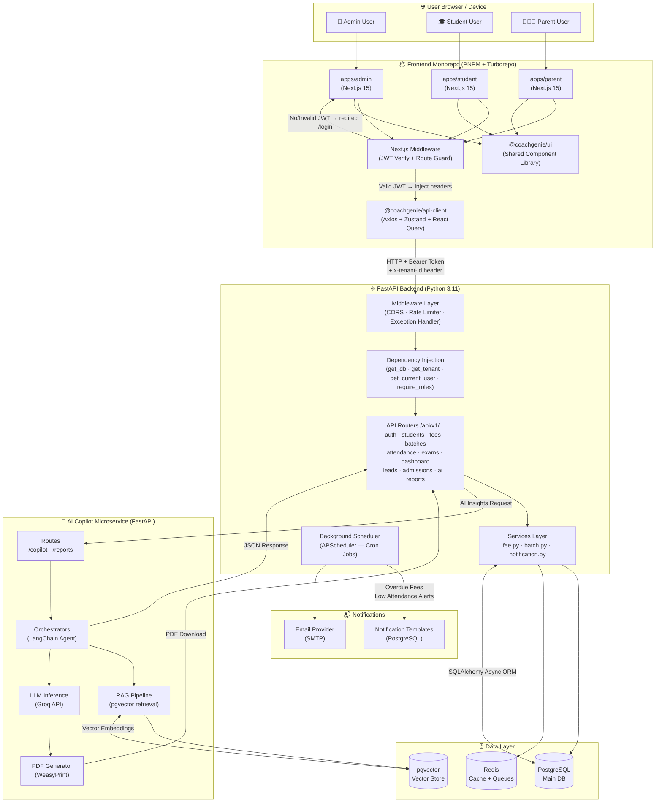
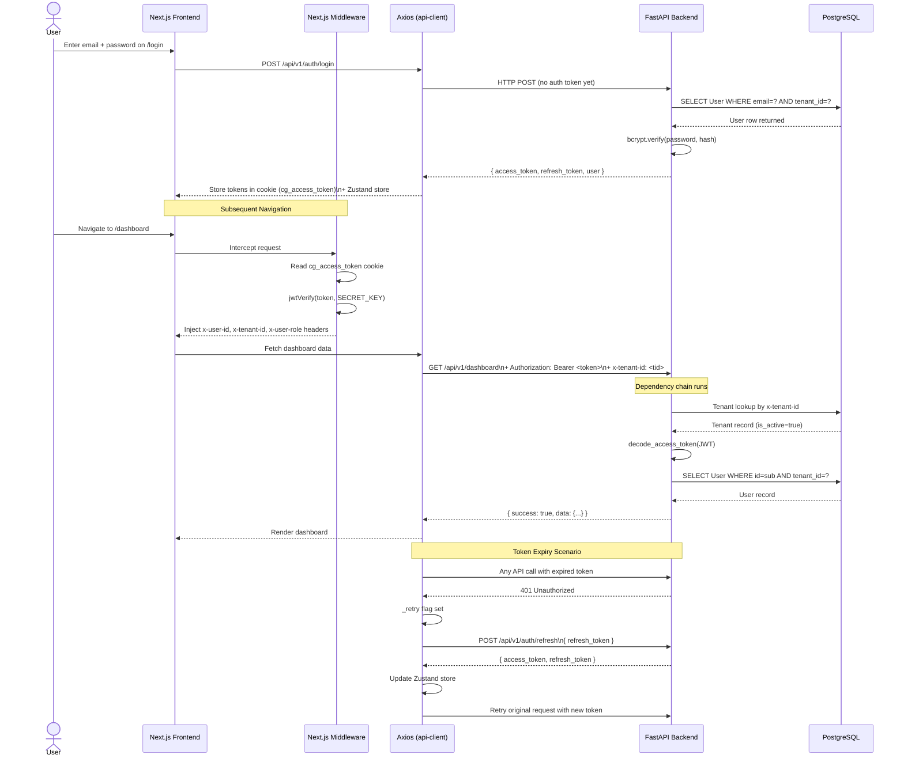
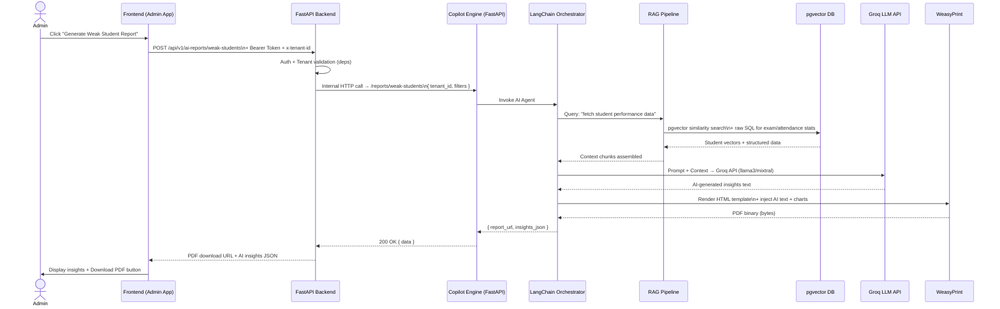
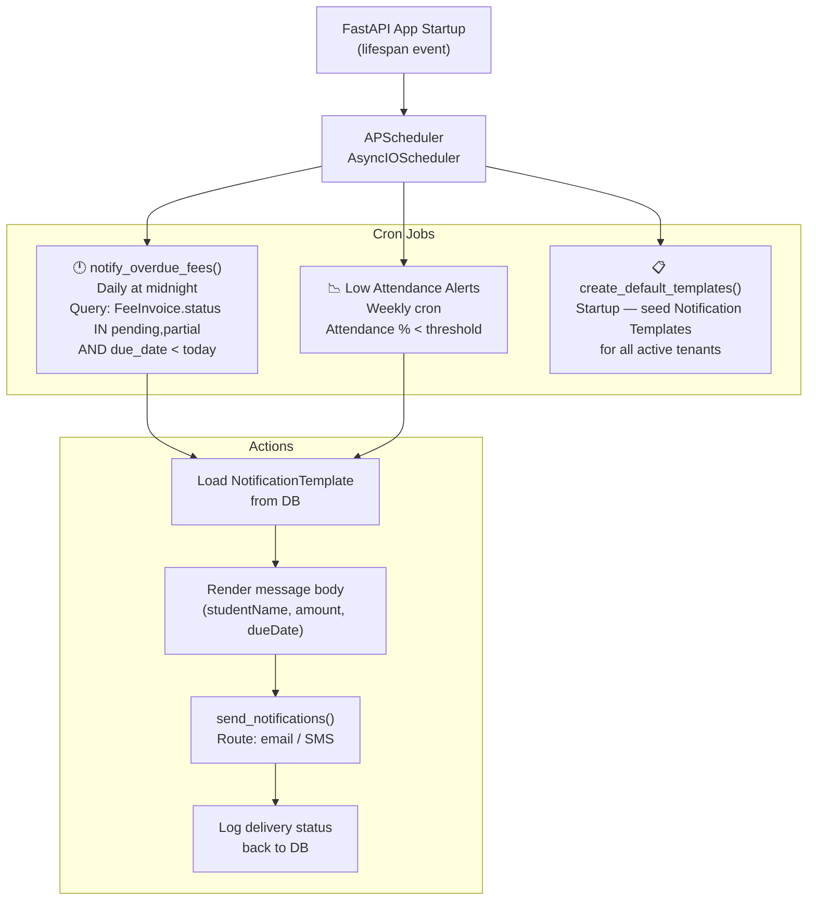
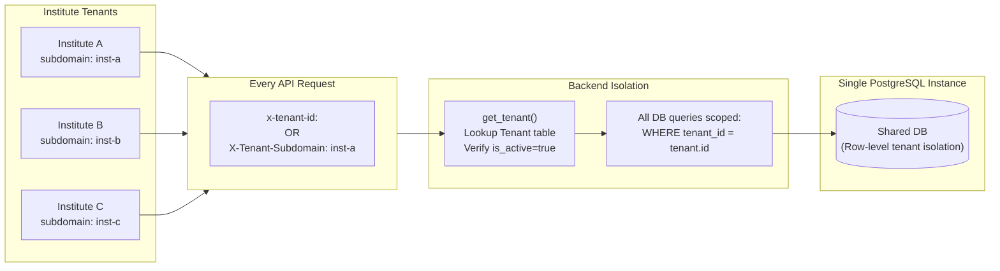
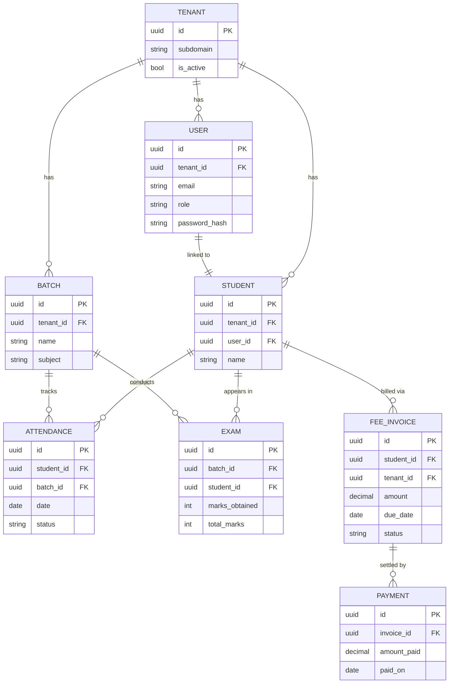

# 🏗️ Coach Genie AI — Complete System Flow Diagram

> Full end-to-end flow of how every layer of the project works together.

---

## 1. 🌐 Top-Level Architecture Flow

---

## 2. 🔐 Authentication Flow (Login → JWT → Protected Request)

---

## 3. ⚙️ Backend Request Lifecycle (Dependency Injection Chain)

```mermaid
flowchart LR
    REQ["📨 Incoming HTTP Request\nPOST /api/v1/fees/invoices"]

    subgraph MIDDLEWARE["Middleware Pipeline"]
        M1["CORS Check\n(AllowedOrigins)"]
        M2["Rate Limiter\n(SlowAPI – IP based)"]
        M3["Exception Handler\n(Global try/except)"]
    end

    subgraph DEPS["Dependency Injection"]
        D1["get_db()\nOpen AsyncSession\n(PostgreSQL)"]
        D2["get_tenant()\nRead X-Tenant-Subdomain/ID\nValidate tenant.is_active"]
        D3["get_current_user()\nVerify JWT Bearer token\nLoad User model"]
        D4["require_roles('owner','counselor')\nCheck user.role\n→ ForbiddenError if denied"]
    end

    subgraph HANDLER["Route Handler"]
        H1["fees.router\ncreate_invoice()"]
        H2["fee_service\n(business logic)"]
        H3["FeeInvoice model\n(SQLAlchemy)"]
    end

    subgraph DB["Data Layer"]
        DB1[("PostgreSQL\n(scoped by tenant_id)")]
        DB2[("Redis Cache")]
    end

    REQ --> M1 --> M2 --> M3
    M3 --> D1 --> D2 --> D3 --> D4
    D4 --> H1
    H1 --> H2
    H2 --> H3
    H3 -->|"INSERT + COMMIT"| DB1
    H2 -->|"Cache invalidate"| DB2
    DB1 -->|"Row returned"| H2
    H2 -->|"Pydantic serialize"| H1
    H1 -->|"{ success: true, data: {...} }"| REQ
```

---

## 4. 🤖 AI Copilot Flow (RAG + LLM Report Generation)

---

## 5. ⏰ Background Scheduler Flow (Automated Jobs)

---

## 6. 🏢 Multi-Tenancy Flow

---

## 7. 🗂️ Data Model Relationships

---

## 📋 Complete Stack Summary

| Layer | Technology | Key Files |
|:---|:---|:---|
| **Frontend Apps** | Next.js 15, Tailwind CSS, TypeScript | `client/apps/admin`, `student`, `parent` |
| **Route Guard** | Next.js Middleware (jose JWT) | `client/apps/admin/middleware.ts` |
| **API Client** | Axios, Zustand, React Query | `client/packages/api-client/src/` |
| **UI Library** | React, Tailwind | `client/packages/ui/` |
| **Backend Entry** | FastAPI, Uvicorn, asyncio | `backend/app/main.py` |
| **Middleware** | CORS, SlowAPI rate limiter | `backend/app/main.py` |
| **Auth & Deps** | JWT decode, bcrypt, RBAC | `backend/app/dependencies.py` |
| **Business Logic** | Service layer (fee, batch, notifications) | `backend/app/services/` |
| **DB Layer** | SQLAlchemy Async 2.0, Pydantic | `backend/app/models/`, `backend/app/database.py` |
| **Scheduler** | APScheduler (AsyncIO) | `backend/app/scheduler.py` |
| **AI Copilot** | FastAPI, LangChain, Groq LLM | `copilot_engine/` |
| **RAG** | pgvector, embedding retrieval | `copilot_engine/rag/` |
| **PDF Reports** | WeasyPrint | `copilot_engine/reports/` |
| **Database** | PostgreSQL + pgvector | Render hosted |
| **Cache** | Redis | Session / queue |
| **Deployment** | Render (Backend), Vercel (Frontend) | `render.yaml` |
